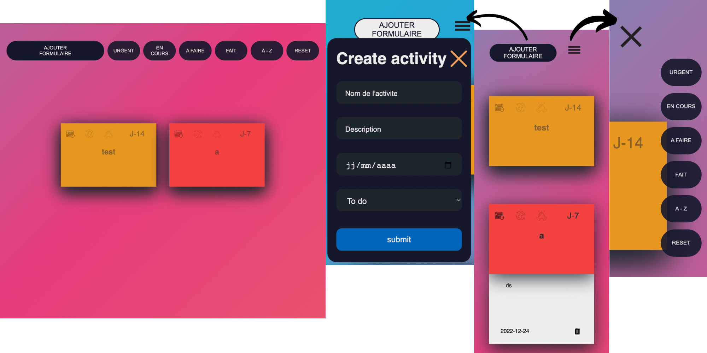

#Planner-Project

In this group project, we created a site similar in function to Trello by mixing DOM, time management and localStorage management.

This site is responsive with a mobile and computer version.

---

Project completed

This project was completed in 3 days during the BeCode student course, from 14 to 16 December 2022

---

## Language

- HTML
- SCSS
- JS

---

## How to install the repository locally

1. create a local working folder
2. open Git Bash
3. clone the repository
4. now you can work on the file